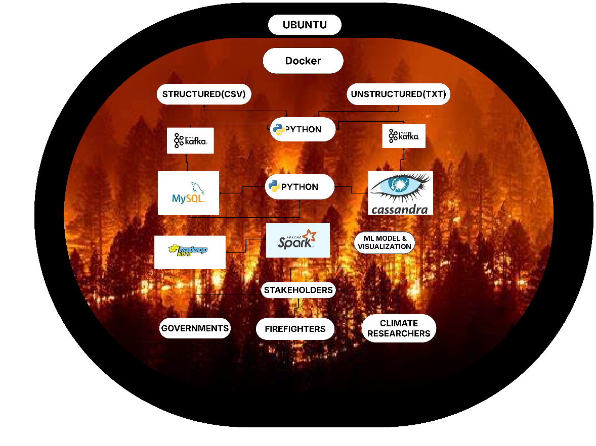

# 🔥 End-to-End Big Data Pipeline for Wildfire Prediction

This repository contains a complete Docker-based big data pipeline for ingesting, processing, and analyzing wildfire and weather data using tools like Kafka, MySQL, Cassandra, Apache Spark, Jupyter, and HDFS.

---

## 📦 Technologies Used

- **Apache Kafka**: Data streaming and message broker
- **MySQL**: Storage for structured weather data
- **Cassandra**: Storage for unstructured satellite fire data
- **Apache Spark**: ETL processing and analytics
- **HDFS**: Final storage for cleaned, merged data
- **Jupyter Notebook**: Interactive data analysis with PySpark
- **Docker & Docker Compose**: Container orchestration
- **Python**: Producers, consumers, ETL scripting

---

## 🚀 Pipeline Overview

1. **Data Ingestion**  
   - Structured weather data (CSV/Excel) is streamed via Kafka into **MySQL**
   - Unstructured satellite fire data (TXT) is streamed via Kafka into **Cassandra**

2. **ETL Pipeline**  
   - Python script reads from MySQL and Cassandra
   - Performs data cleaning and merging
   - Saves merged output to **HDFS**

3. **Analytics**  
   - Jupyter notebook with PySpark reads from HDFS
   - Enables analysis, model training, and visualization

---
## 🗺️ Architecture Diagram



---

## 🧰 Prerequisites

- Docker & Docker Compose (v2 recommended)
- 8GB+ RAM machine (recommended)
- Port availability: `9000`, `50070`, `7077`, `8081`, `8082`, `8888`, `3306`, `9042`

---

[Dataset Link](https://mnscu-my.sharepoint.com/:f:/g/personal/tw9520gi_go_minnstate_edu/EiQi0qA82AdFtiLH_LZWn-cBGAC7wSr4OMfj5505f-cZQA?e=0JSqL7)

---
## 🏗️ How to Run the Pipeline

### 1. Clone this repository

```bash
git clone https://github.com/Dev-dk404/Wildfire-Prediction-EndToEnd-BigDataPipeline.git
cd Wildfire-Prediction-EndToEnd-BigDataPipeline
```

### 2. Start all services
Before starting all services, we need to create two separate volumes that could be mounted on HDFS namenode and datanote containers. 
```bash
docker volume create hdfs_namenode_data
docker volume create hdfs_datanode_data
```
After creating those volumes, start all the containers and check the status after they are started.
```bash
docker compose up -d
docker compose ps
```

This will start:
- 2 Kafka Containers, Kafka UI
- MySQL and Cassandra
- Spark Master & Worker
- Jupyter Notebook
- HDFS Namenode and Datanode
- Python

To stop and start containers
```bash
docker compose stop
docker compose start
```
Note: Performing docker compose down might delete all the data stored in MySQL, Cassandra and HDFS. 

### 3. Stream data
Download the data from the Dataset link provided on the above link.
- Run requirements.txt file to install essential python packages needed to run our environment.

```bash
docker exec -it python-service bash
pip install -r requirements.txt
```

- Run the **Kafka producer** to send Excel/CSV data (structured_final.csv) into MySQL.
- Run the **Kafka producer** to send TXT data (fire_data.txt) into Cassandra.
- Run all these files in 4 separate python bash terminals (2 producers and 2 consumers) as it takes some time to produce kafka topics and consume them.

```bash
docker exec -it python-service bash
python kafkaProducer_sql.py
python kafkaProducer_cassandra.py
```

### 4. Run the Kafka consumers

```bash
python kafkaConsumer_sql.py
python kafkaConsumer_cassandra.py
```
Kafka UI can be assessed on any browser on the following port at localhost. You can view all kafka topics and brokers there.

``` bash
localhost:8080/
```
## 🛠️ How to Access MySQL and Cassandra to View Ingested Data

### 🔍 Access MySQL and Query Data

```bash
docker exec -it mysql-container bash
mysql -u root -p
# Password: password

USE testdb;
SHOW TABLES;
SELECT * FROM wildfire_data LIMIT 10;
```

---

### 🔍 Access Cassandra and Query Data

```bash
docker exec -it cassandra-container cqlsh

USE wildfire;
DESCRIBE TABLE hotspots;
SELECT * FROM hotspots LIMIT 10;
```

This allows you to verify that Kafka producers and consumers are working correctly and data is successfully inserted into both databases.


### 5. Perform ETL
ETL script is present on etl.py file. We run that file inside python container.

```bash
docker exec -it python-service bash
python etl.py
```

This will output `merged_output.csv`, now upload it to HDFS at `/cleaned/merged_output.csv`.

```bash
docker exec -it python-service bash
python hdfs_connection.py
```
Hadoop UI is accessible at localhost, port 50070 where we can view the datanodes. Data can viewed inside Utilities/Browse the file system.

```bash
http://localhost:50070
```

### 6. Access Jupyter Notebook

Run this command to get your jupyter-pyspark container’s ip address

```bash
docker inspect -f '{{range .NetworkSettings.Networks}}{{.IPAddress}}{{end}}' jupyter-pyspark
```
Run this command to get jupyter token for login screen
```bash
docker exec jupyter-pyspark jupyter server list
```
Copy the URL, replace it using container ip address as below:
http://CONTAINERIPADDRESS:8888

You should see the Jupyter Notebook interface. Use this to run the Spark MLlib code. 
Load `Final_Model.ipynb` and run PySpark against HDFS.

---

## 📱 Access Presentation File


---

## 👨‍💻 Author
Devendra Adhikari,
Srajan Jain,
Ritesh Janga,
Hermela Dessie


